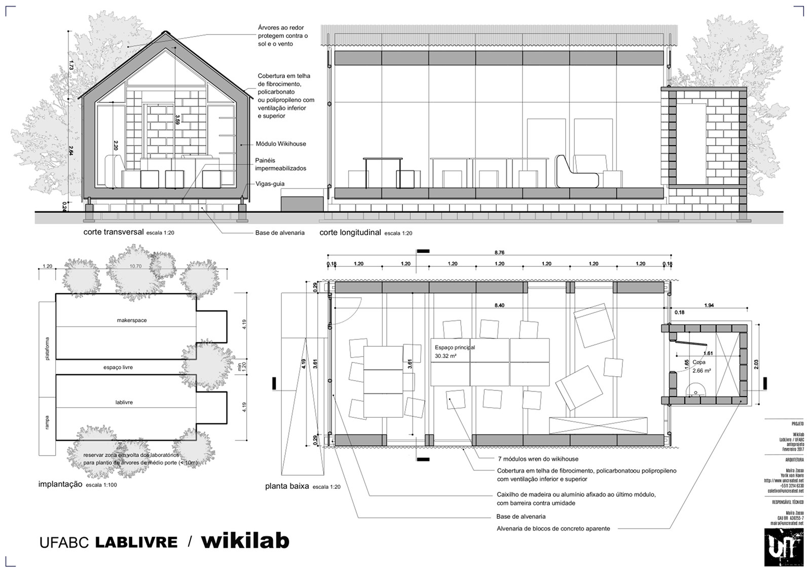

# wikilab

Um laboratório experimental baseado no [wikihouse](http://wikihouse.cc/) e na [casa modelo](http://www.archdaily.com.br/br/773676/casa-revista-a-primeira-casa-fabricada-digitalmente-no-brasil) da UFRJ (também feito com o wikihouse).

Este projeto está em fase de desenvolvimento para ser construidono correr de 2017. O projeto está desenvolvida de forma aberta como parceria entre diferentes entidades incluindo o labLivre da UFABC e o [uncreated.net](http://www.uncreated.net)

Nas pastas deste projeto, podem ser encontrados:

* Um arquivo .FCStd a ser aberto com o [FreeCAD](http://www.freecadweb.org) contendo o projeto completo em 3D
* Um arquivo .blend a ser aberto com o [Blender](http://www.blender.org) contendo o mesmo modelo para geração de imagens
* Um arquivo .ods (LibreOffice) contendo o orçamento preliminar do projeto
* Uma pasta com exemplos e referências de outros projetos
* Uma pasta "folhas" com um [documento de apresentação](folhas/completo.pdf) em .pdf
* Um [anteprojeto de arquitetura](folhas/folha%20A1.pdf) em .pdf (formato A1)
* Diversas pastas com elementos (texturas, modelos,etc) necessários à elaboraço do conteúdo acima
* Um arquivo .dxf que é uma amosta das folhas de cortes que sero geradas para fazer o cortes dos painéis  em máquinas CNC

Veja também o [modelo no sketchfab](https://sketchfab.com/models/bab56ed7d2414e13b3eacd6c2f29ce65)

