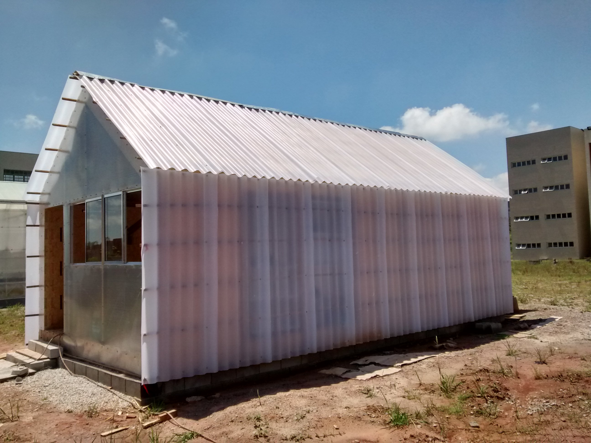

# wikilab

Um laboratório experimental baseado no [wikihouse](http://wikihouse.cc/) e na [casa modelo](http://www.archdaily.com.br/br/773676/casa-revista-a-primeira-casa-fabricada-digitalmente-no-brasil) da UFRJ (também feito com o wikihouse).

[English version here](english.md)

Este projeto foi construído no segundo semestre de 2017. O projeto foi desenvolvido de forma aberta como parceria entre diferentes entidades incluindo o labLivre da UFABC e o [uncreated.net](http://www.uncreated.net)

Nas pastas deste projeto, podem ser encontrados:

* O modelo principal do projeto, que é o arquivo [wikilab.FCStd](wikilab.FCStd) a ser aberto com o [FreeCAD](http://www.freecadweb.org) contendo o projeto completo em 3D ([BIM](https://pt.wikipedia.org/wiki/BIM))
* O módulo de base, que serviu para o corte das peças com máquina CNC, está no arquivo separado [modulo wren.FCStd](modulo wren.FCStd)
* Um manual de construção, que descreve passo a passo todas etapas da construção do Wikilab
* Fotos da preparação, da montagem (obra) e do Wikilab acabado
* A pasta "apresentação" contém arquivos .blend do mesmo modelo, para geração de imagens, a serem abertos com o [Blender](http://www.blender.org)
* Na parta "orçamento" estão as planilhas dos orçamentos preliminares e definitivo do projeto. O projeto foi construido, com algumas trocas e modificações, dentro do preço do orçamento final
* Exemplos e referências de outros projetos
* Plantas clássicas de arquitetura, que foram feitas para obtenção da aprovação do projeto junto a UFABC, está no pasta "aprovação 
* A pasta "folhas de corte" contem as bases que foram extraidas do modelo 3D, e os arquivos gcode que forma gerados a partir dessas bases

Veja também o [modelo no sketchfab](https://sketchfab.com/models/bab56ed7d2414e13b3eacd6c2f29ce65)

