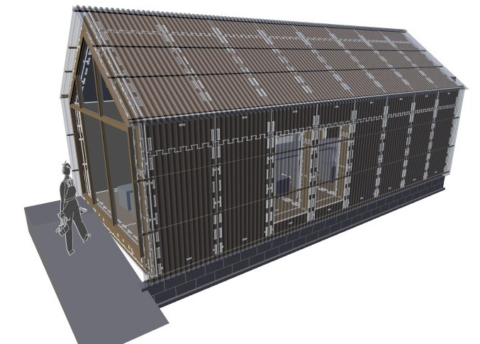
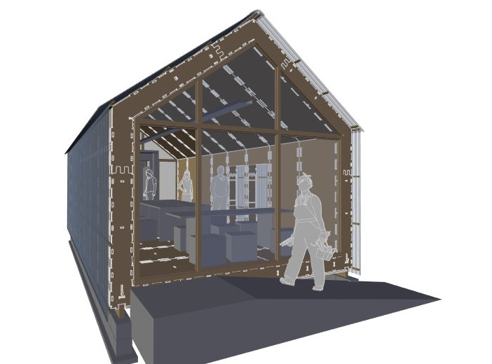
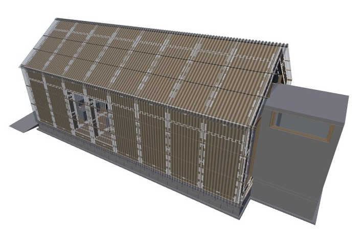

# wikilab

Um laboratório experimental baseado no [wikihouse](http://wikihouse.cc/) e na [casa modelo](http://www.archdaily.com.br/br/773676/casa-revista-a-primeira-casa-fabricada-digitalmente-no-brasil) da UFRJ (também feito com o wikihouse).

Veja o [modelo no sketchfab](https://sketchfab.com/models/bab56ed7d2414e13b3eacd6c2f29ce65)

