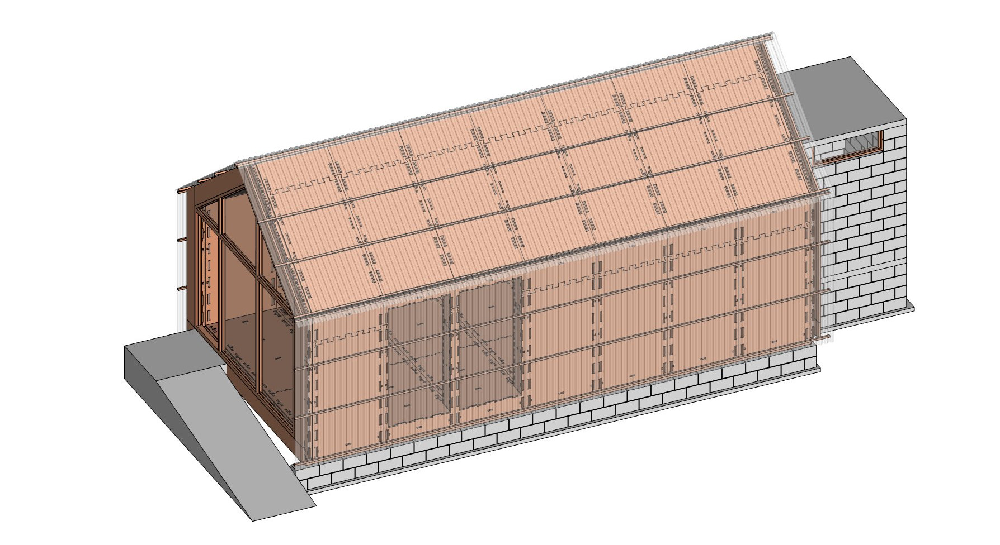
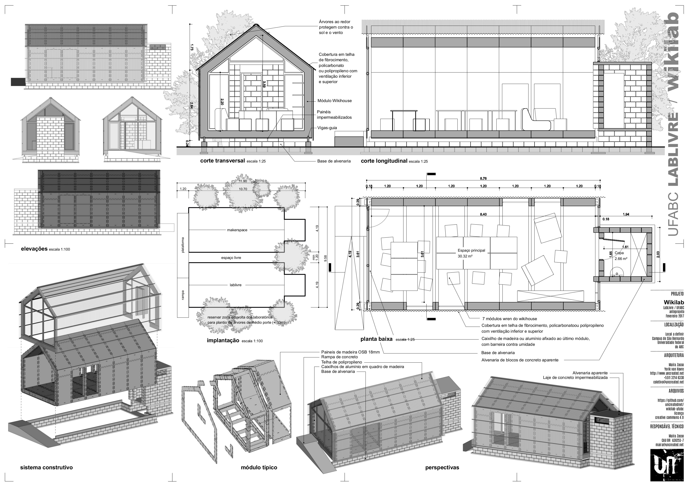

# wikilab

An experimental laboratory made with [wikihouse](http://wikihouse.cc/) technology, to be built on the [São Bernardo campus](https://www.google.com.br/maps/place/UFABC+-+Universidade+Federal+do+ABC+-+Campus+S%C3%A3o+Bernardo+do+Campo/@-23.6774308,-46.5664299,17z/data=!3m1!4b1!4m5!3m4!1s0x94ce43a800827001:0xb566e18f4220a86b!8m2!3d-23.6774308!4d-46.5642412?hl=en) of the [UFABC](http://www.ufabc.edu.br/) university, in the São Paulo area, Brazil. It is based on the wikihouse [wren module](https://github.com/wikihouseproject/Wren/wiki/Wren-Technical-Design-Guide) and also reuses some of the solutions experimented by the [casa modelo](http://www.archdaily.com.br/br/773676/casa-revista-a-primeira-casa-fabricada-digitalmente-no-brasil) project made at [URFJ](https://ufrj.br/) in 2015.

The laboratory will host both the [Free Software Laboratory](http://pesquisa.ufabc.edu.br/lablivre/) of UFABC and a [Makerspace](https://en.wikipedia.org/wiki/Hackerspace) used by the [hacker communities of the ABC region](http://www.facebook.com/abcmakerspace/) and form a link between the university, free software, local community and  hacking/making movements.

*See also [a 3D version on Sketchfab](https://sketchfab.com/models/25cfcc0eaea24e3394ba76c1929d31ca)*

### The project

The project is now in development phase. The terrain will be donated by the university, and the construction costs covered by an ongoing [crowdfunding campaign](https://www.catarse.me/wikilab).

All the project documents, files, images, plans, spreadsheets are [available online](https://github.com/uncreatednet/wikilab-ufabc), all the material that will be gathered further during the rest of the project phase and the construction itself will also be shared at the same location.

The project development is done in portuguese, using open-source software, namely [FreeCAD](http//www.freecadweb.org), [Blender](http//www.blender.org), [libreOffice](http//www.libreoffice.org) and [inkscape](http://www.inkscape.org). In this project repository, you will find the project's 3D CAD file in [FreeCAD](wikilab.FCStd) and [Blender](wikilab.blend) formats, [renderings](render/) and other images, [presentation documents](folhas/) in PDF format, and [cost and schedule estimations](or%C3%A7amento.ods) in ODS format.

### The building system

The building will adopt a hybrid system, with a base made in concrete blocks, on top of which the wikihouse system will be built. Finally, it will be covered by a skin made of polypropylene, polycarbonate or fiber-cement panels.

This hybrid system is an interesting idea to use in this case, for several reasons:

* Being located in Southeast Brazil, which has a very mild climate, there is no need for protection against he cold. Gaps and weaknesses in the joints  between the wikihouse part and the masonry part are therefore not a big problem.
* All the hydraulic parts have been concentrated in the masonry parts, leaving the wooden part free of water tubes and appliances.
* The wooden wikihouse part is better protected against humidity by a good ventilation than by humidity barriers. Therefore, the outer skin is separated from the wooden structure, allowing air to flow between the two. The skin is open at the bottom and at the top, as well as on the front and back sides, to create natural convection with the heat generated by the sunrays hitting the exterior skin.
* These two sides also have openable windows, which create a constant ventilation on both the inner and outer sides of the wikihouse structure, and allow to dissipate the heat that could come through.
* If needed, further solutions to regulate the heat can be imagined when the building is functionning, such as sun breakers, or covering vegetation.
* The hybrid building system is also an interesting social experiment, as one part of the construction will be executed by a contractor, while the other (the wikihouse part) will be built by a team of volunteers.  We hope to develop new ways of interaction between these two actors. This way, the wikihouse system can also be more easily understood not as a revolution against traditional building techniques, but rather as an evolution.

### Collaborative approach

The adaptation of the Wikihouse [Wren module](https://github.com/wikihouseproject/Wren/wiki/Wren-Technical-Design-Guide) into this project has been done originally by Maíra and Yorik of [uncreated.net](http//www.uncreated.net) with almost no modification of the base module. The pretension is to build by the book, and follow the guidelines as close as possible, to minimize possible problems and also contribute with a kind of "tropical version" of the Wren module guidelines.

Another aim is to develop simple and adaptive ways to create natural climate control, using cheap techniques and materials. This is an ongoing process that will last for much longer than the construction time, as it will develop during the laboratory lifetime.

All these experiments are and will continue to be fully documented here, to be used by anybody interested. The whole process, including the further developments of the project, are open to anybody interested in contributing. Contact [Maíra or Yorik](http//www.uncreated.net), or simply create a [Github](http//www.github.com) account and open an issue on this repository to start a conversation. The project also has a [Facebook page](https://www.facebook.com/wikilab.abc/) (in portuguese) and regularly organizes meetings in São Bernardo where anybody interested is welcome to participate.

