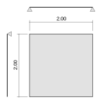

# Cálculo das lajes

usando o método de Marcus ([tabelas](https://drive.google.com/file/d/0B_sf8aj9_lOfUndZOWZqelZ1c2M/view?usp=sharing))

e método [curso de engenharia da USP](http://www.set.eesc.usp.br/mdidatico/concreto/Textos/11%20Lajes%20Macicas.pdf)

respeita [NBR 6118](https://drive.google.com/file/d/0B_sf8aj9_lOfVngzNnpPVkN6aWc/view?usp=sharing) e [NBR6120](https://drive.google.com/file/d/0B_sf8aj9_lOfbG9CeE1PY1ZnVHc/view?usp=sharing)

## 1. Predimensionamento / flexão máxima

Usando a [NBR 6118](https://drive.google.com/file/d/0B_sf8aj9_lOfVngzNnpPVkN6aWc/view?usp=sharing)

Fórmula: d >= L / (psi2 x psi3)

psi2 = 1 (apoios simples em 3 lados)

psi3 = 30 (usando CA-50)

d = 200 cm / (1 x 30) = 6.7cm

espessura = 6.7 cm + 2 cm de recobrimento (tipo I da NBR) = 8.7 cm = **9 cm**

## 2. Área e carga

Área: 2 m x 2 m = **4 m²**

Peso próprio = 0.09 m x 2500 kg/m³ (concreto) = 225 kg/m² = 2.25 kN/m²

Sobrecarga = 200 kg/m² (carga padrão para uso residencial) = 2 kN/m²

Carga total = **4.25 kN/m²**

## 3. Tabela de Marcus

Usando o caso 1 da [tabela de Marcus](https://drive.google.com/file/d/0B_sf8aj9_lOfUndZOWZqelZ1c2M/view?usp=sharing), sem engastes:

Lx / Ly = 2.00 / 2.00 = 1

mx = 27.4

my = 27.4

Kx = 0.5

## 4. Cálculo dos momentos máximos

Usando a tabela de Marcus:

Mx = qL²/mx = 4.25 kN/m² x 4 m² / 27.4 = 0.62 kNm = **6.2 tfcm**

My = Mx = 0.62 kNm = 6.2 tfcm

qx = Kx x q = 0.5 x 4.25 kN/m² = 2.125 kN/m²

Considerando que um lado é engastado (improvável, só para ver o que seria o caso extremo)

Ma = -qL²/8 = -2.125 kNm = -21.25 tfcm

Usando a NBR ([tabela de Bares](https://drive.google.com/file/d/0B_sf8aj9_lOfZUlBdGNsOEcyMWM/view?usp=sharing)):

Caso 1 (apoios simples)

Mux = Muy = 4.23

Mx = My = Mux x qL²/100 = 4.23 x 4.25Kn/m² x 4 / 100 = 0.71 kNm = **7.1 tfcm**

##5. Dimensionamento das ferragens 

Usando aço CA-50 / concreto C20

~~x = metade da altura total da laje = 9cm / 2 = 4.5cm~~

d = altura da laje acima da ferragem = 7cm

**Dimensionamento para Mx/My (Marcus)**

~~Usando sigma calculado = x/d = 4.5/7 = 0.6428 -> k6 = 41 -> k3 = 0.429~~

Usando k6 da tabela = 00 x d² / q = 100 x 7² / 6.2 tfcm = 790 -> k3 = 0.325

Área de aço As = 0.325 x 6.2 / 7 = **0.28 cm²/m**

**Dimensionamento para Mx/My (NBR)**

Usando [Tabelas Gerais](https://drive.google.com/file/d/0B_sf8aj9_lOfUGpUWXpqQ3o5UVE/view?usp=sharing)

Usando momento de cálculo Md = 1.4 x Mx = 1.4 x 0.71 kNm = 0.994 kNm = 99.4 kNcm

kc = bd²/Md = 100 x 7² / 99.4 = 49.3 cm²/kN

ks = 0.023 (tabela)

Área de aço  As = ks x Md / d = 0.023 x 99.4 / 7 = **0.32 cm²/m**

**Dimensionamento para Ma** (caso não existente  apenas para ver o que seria o extremo)

~~Usando sigma calculado = x/d = 4.5/7 = 0.6428 -> k6 = 41 -> k3 = 0.429~~

Usando k6 da tabela = 100 x d² / q = 100 x 7² / 21.25 tfcm = 230 -> k3 = 0.331

Área de aço As = 0.331 x 21.25 / 7 = **1.0 cm²/m**

## 6. Verificação tamanho mínimo (NBR):

As min = 0.00075 x h xl = 0.00075 x 7 x 100 = **0.52 cm²/m**

## 7. Ferragens

Telas disponíveis e área em cm²/m

| Bitola | 20 cm | 15 cm | 10 cm |
| ------ | ----- | ----- | ----- |
| 3.4 mm | 0.36  | 0.54  | 0,81  |
| 4.2 mm | 0.55  | 0.82  | 1.24  |

Ferragem apropriado: **4.2 mm x 20 cm ou 3.4 mm x 15 cm**

