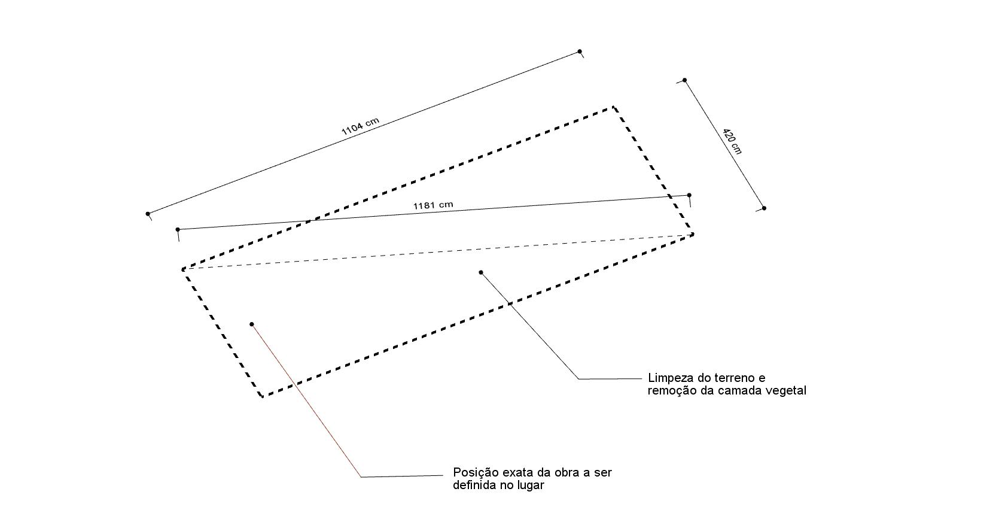
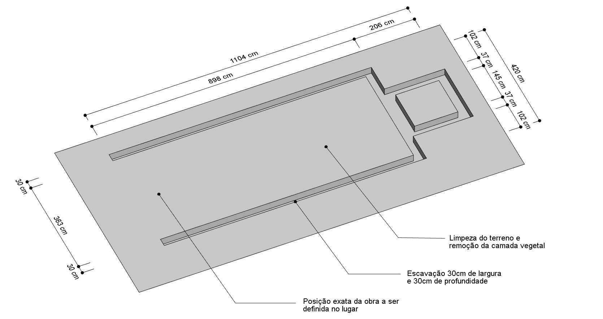

# Manual de montagem

## WikiLab

Este manual de montagem segue o [manual original da MicroHouse](https://github.com/wikihouseproject/Microhouse/blob/master/MicroHouse_AssemblyManual_v1_sm.pdf) com acréscimo das partes que não são feitas com tecnologia WikiHouse, e algumas particularidades próprias ao projeto WikiLab.

### 1. Preparo do terreno e escavação

O perímetro de construção de 11.04m x 4.20m deve ser marcado no terreno com 4 marcadores nos cantos. A medida diagonal de 11.81m permite verificar que os cantos estejam com ângulos retos.

Escavação de uma vala para fundação corrida. Profundidade = 30cm, largura = 30cm. Área total da escavação = 8.68 m², volume de terra a ser retirado = 8.68 x 0.30 = 2.6 m³.

O fundo da vala deve ser coberto de uma camada de 5cm de areia seca, e em seguida apiloado e compactado manualmente.

Após a colocação da camada de areia, o fundo da vala deve estar a 25 cm de profundidade.

### 2. Fundação em alvenaria

Na base da vala é colocada uma camada de 5cm de concreto magro, que forma a base da fundação.