# Manual de montagem

## WikiLab

Este manual de montagem segue o [manual original da MicroHouse](https://github.com/wikihouseproject/Microhouse/blob/master/MicroHouse_AssemblyManual_v1_sm.pdf) com acréscimo das partes que não são feitas com tecnologia WikiHouse, e algumas particularidades próprias ao projeto WikiLab.

**Falta**: Imagem geral

## 1. Alvenaria

Observação: Esta parte é prevista para ser realizada por empreiteira, pedreiro ou outra pessoa que tenha experiência na construção.

**Falta**: Imagem geral

### 1.1. Preparo do terreno e escavação

O perímetro de construção de 11.04m x 4.20m deve ser marcado no terreno com 4 marcadores nos cantos. A medida diagonal de 11.81m permite verificar que os cantos estejam com ângulos retos.

Escavação de uma vala para fundação corrida. Profundidade = 30cm, largura = 30cm. Área total da escavação = 8.68 m², volume de terra a ser retirado = 8.68 x 0.30 = 2.6 m³.

O fundo da vala deve ser coberto de uma camada de 5cm de areia seca, e em seguida apiloado e compactado manualmente.

Após a colocação da camada de areia, o fundo da vala deve estar a 25 cm de profundidade.

### 1.2. Fundação em alvenaria

Na base da vala é colocada uma camada de 5cm de concreto magro, que forma a base da fundação. Sobre esta camada é constuida uma mureta de duas fileiras de blocos de concreto de 19 x 19 x 39cm, aparelhados e grauteados com argamassa.

**Falta**: Descrição e fabricação da argamassa

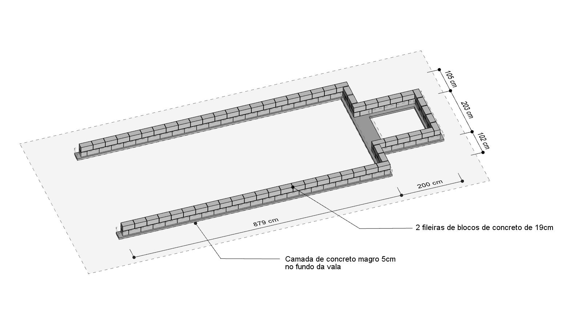

**Falta**: Ferragens para refoço nos cantos?

A cada 3 blocos, é colocada uma barra de aço filetada em posição vertical. Os dois blocos abaixo de cada barra devem ser grauteados. A barra deve ter no mínimo 12 cm livres acima da alvenaria (mais se se planeja usar vigas-guia maiores que 8cm). A distância entre as duas fileiras de barras deve ser **exatamente 390cm**

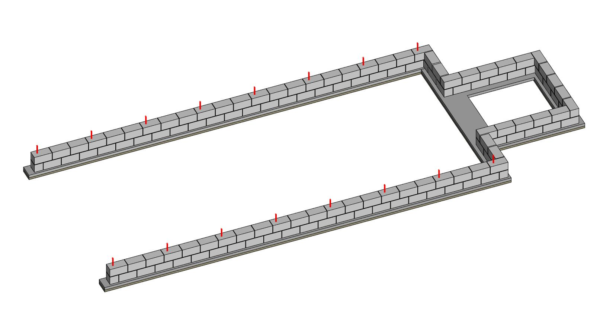

**Falta**: Verificar posição dos ferros x costelas

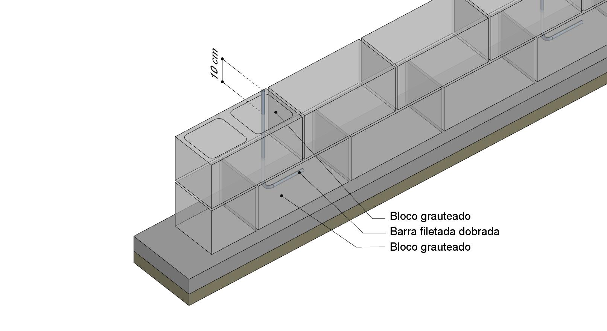

**Falta**: Descrição da filetagem

Tubos de PVC para esgoto (pia e WC) e chegada de água fria estão colocados na parte interna da parede do banheiro, com cotovelos e saída embaixo da fundação. 

**Falta**: concretagem do solo

**Atenção**

Verificar, antes de colocar a tubulação, a localização das caixas coletoras de esgoto, e da disponibilidade de chegada de água fria

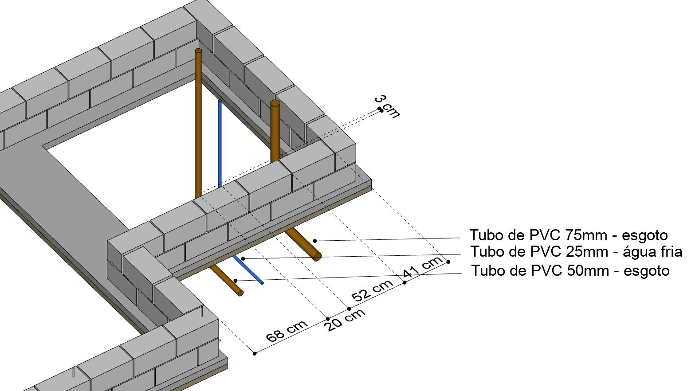

**Falta**: Eletricidade

Em seguida, as duas fileiras de blocos são impermeabilizadas com pintura bituminosa:

Apos esta operação, as valas devem ser reaterradas até o nível do solo.

**Falta**: imagem após reaterro

Duas fileiras adicionais são colocadas em cima do bloco sanitário:

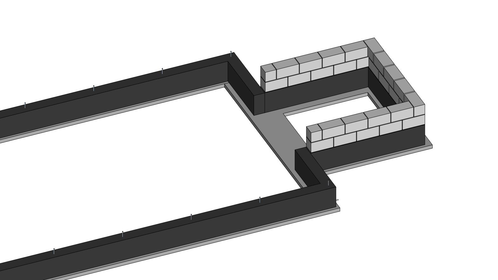

### 1.3. Alvenaria superior e lajes

Antes de realizar a laje do bloco sanitário,  a parte situada embaixo da laje será reaterrada e compactada, para formar uma base para a concretagem. A terra é em seguida recoberta com uma membrana plástica.

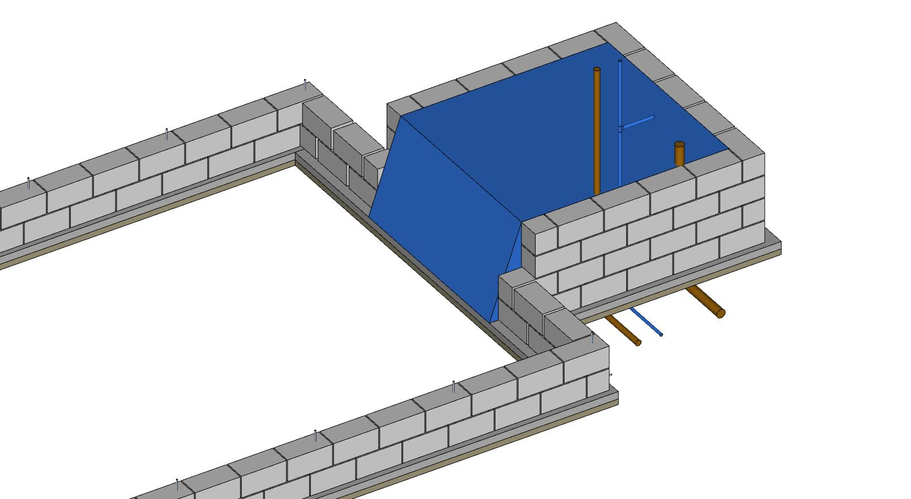

Tábuas são colocadas na periferia e pregadas umas à outras. A borda superior das tábuas deve ser perfeitamente horizontal, a 9 cm em cima da alvenaria. Os furos dos blocos de alvenaria podem ser tampados com papelão, isopor ou areia

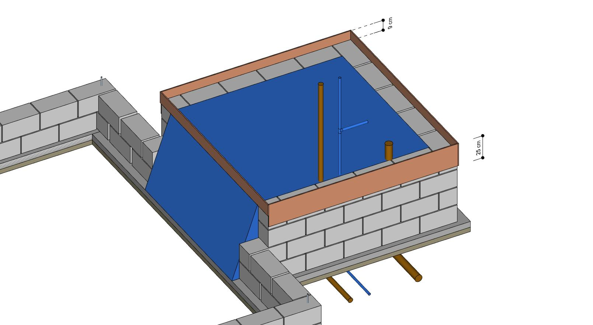

No fundo da forma é colocada uma tela de aço de bitola 4.2mm com malha de 20cm, ou de bitola 3.4mm com malha de 15cm, sobre espaçadores de plástico para manter a tela a 2cm do fundo da forma

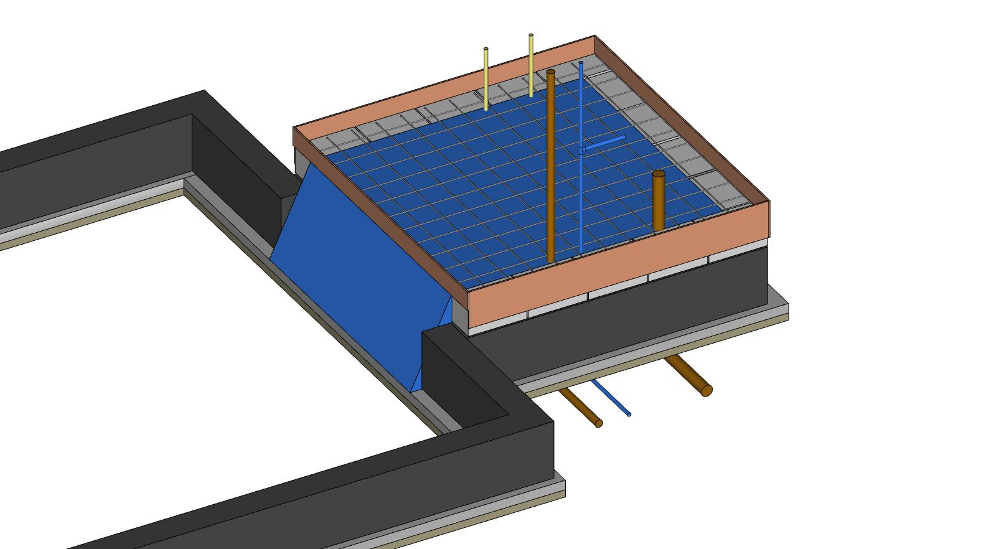

Finalmente o concreto é colocado para formar uma laje de 9cm de espessura, até a borda superior das tábuas. Depois da concretagem, as formas de madeira devem permanecer por 3 dias, e a laje deve ser regada 3 vezes por dia, e coberta por uma lona para freiar a evaporação, durante 7 dias.

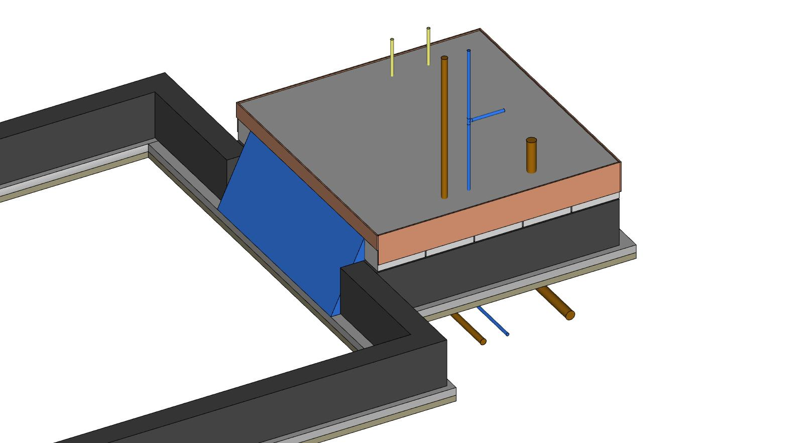

**Falta**: Representar por símbolos a rega e a cura, e composição do concreto

A partir de 24 horas após a concretagem, a primeira fileira de blocos já pode ser colocada. Devem ser preivistas barras de reforço de aço de 5mm de 50cm de comprimento em cima da primeria fileira.

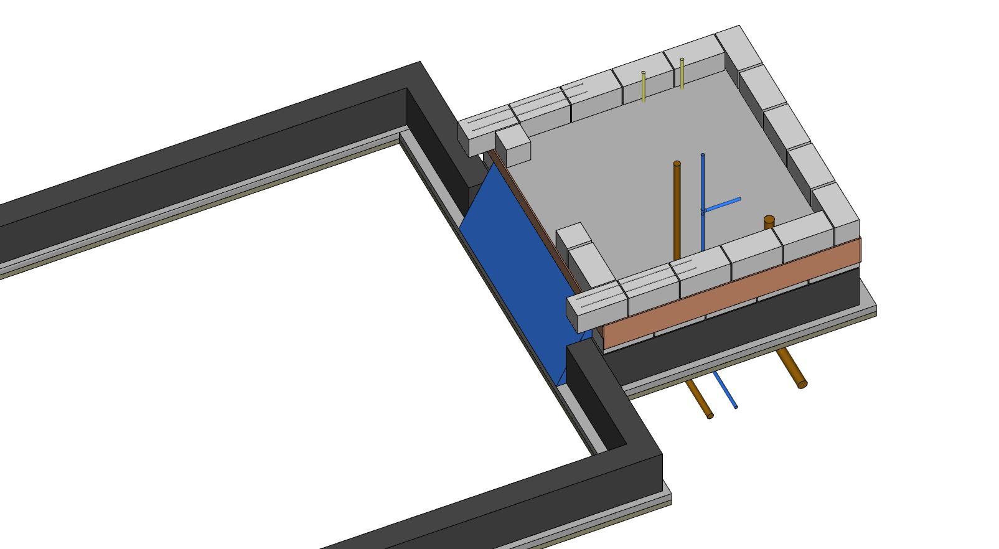

Depois se colocam 11 outras fileiras, para obter uma altura total de 12 fileiras x 20cm = 240cm.

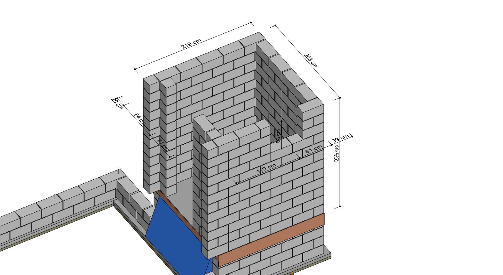

A forma da laje superior é feita com painéis de compensado suportados por escoras

Os painéis de borda são colocados da mesma maneira que a laje inferior, para formar uma laje de 9cm do lado exterior, 10cm do lado interior, para formar uma leve inclinação.

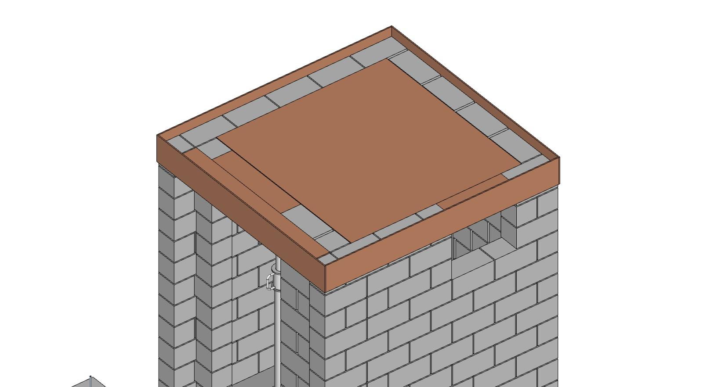

Uma tela metálica idêntica à laje inferior (bitola 4.2mm com malha de 20cm, ou de bitola 3.4mm com malha de 15cm) é colocada sobre espaçadores de 2cm

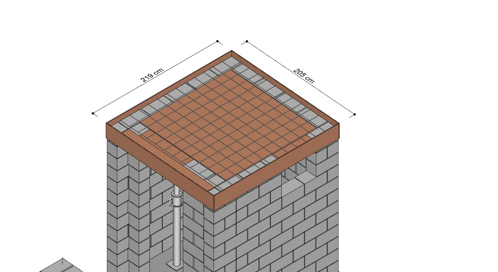

E finalmente o concreto é colocado, com adjuvante impermeabilizante. Duas regras são colocadas para formar uma borda de 2cm

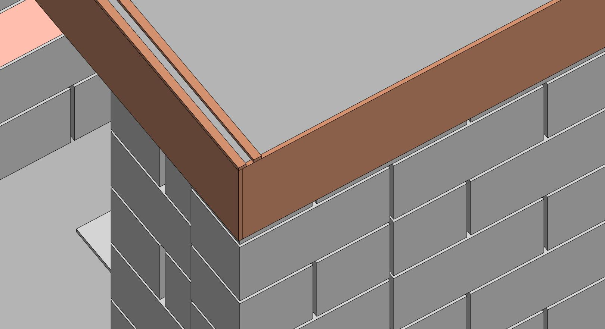

A laje deve ser coberta por lona e regada 3 vezes por dia durante 7 dias. As tábuas laterais podem ser retiradas após 3 dias, e as escoras após 21 dias.

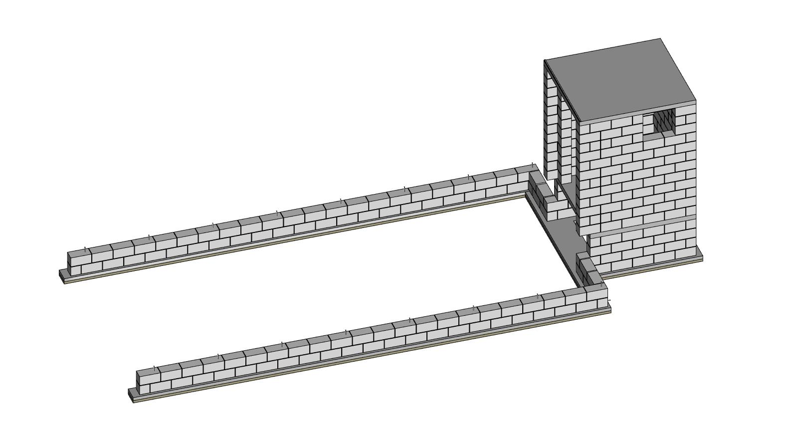

### 1.4. Hidráulica

Cancelado

**Falta**: Elaborar esta seção

### 1.5. Vigas-guia

As vigas-guia são feitas de perfis de madeira maciça de 6cm x 8cm (ou mais). É muito importante cuidar para obter uma perfeita horizontalidade do conjunto.

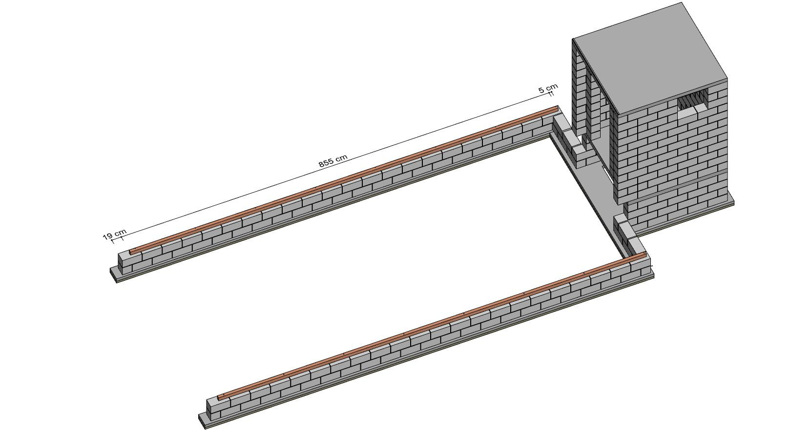

**Falta**: métodos para verificar a horizontalidade

As vigas-guias são fixadas com rodelas e porcas compatíveis com o diâmetro das barras filetadas

## 2. WikiHouse

Esta parte é prevista para ser construída por voluntários. Atenção, uma obra é um entorno perigoso. Verifique que todas as pessoas presentes na obra usem equipamento de segurnaça (capacete, luvas, sapatos fechados, óculos de proteção, e colete sinalizador se for trabalhar onde veículos transitam).

**Falta**: Descrição EPI

**Falta**: Imagem geral

**Falta**: Descrição equipamento/material necessário

### 2.1. Estrutura principal da wikihouse

A primeira parte da montagem consista em montar 8 elementos estruturais. Deve ser reservado um espaço seco, horizontal, e com piso duro (concreto, asfalto, etc...) de mais ou menos 5m x 5m, onde será montado cada elemento, e um outro lugar para armazenar os elementos prontos. Cada elemento faz mais ou menos 4m x 4m. Podem ser armazenados horizontalmente ou verticalmente, mas devem ser sempre protegidos da umidade.

**Falta**: Imagem geral

As peças são numeradas e fáceis de montar com martelos de borracha. Os martelos são indispensáveis para efetuar a montagem, cada pessoa presente deve dispor de um martelo.

É recomendado sempre tentar por a numeração da peça do lado exterior, para ser mais facilmente identificável após a montagem.

O primeiro passo é colocar no chão os 6 elementos da camada de base:

Em cima dessa primeira camada, 5 peças de reforço:

As peças de reforço, opcionalmente, podem ser coladas ou parafusadas nas peças principais em baixo.

A etapa seguinte é montar o miolo. É melhor montar todo o miolo a parte:

Em seguinda, o miolo é inserido nas duas camadas colocadas anteriormente:

Depois, mais uma camada de peças de reforço:

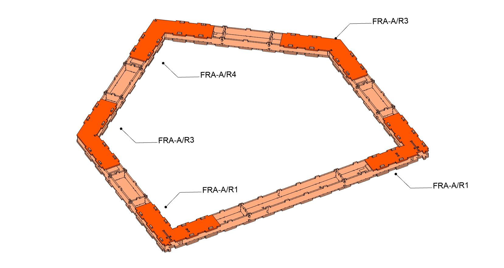

E a camada exterior final:

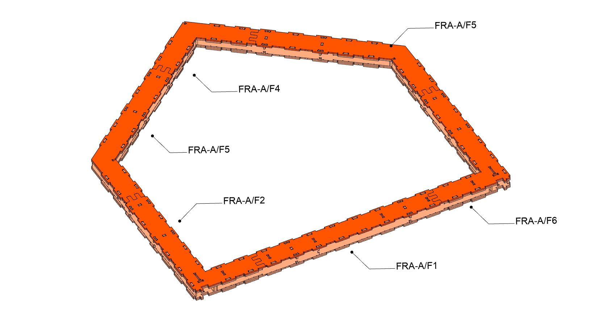

A última etapa é a colocação dos "skis". Podem ser difíceis de colocar, é melhor começar pelo meio. Deve ter um pouco de cuidado para não danificar as peças.

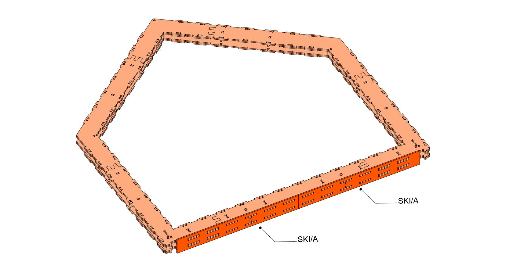

São 8 elementos como este. Se não vão ser usado imediatamente, podem ser armazenados deitados ou levantados, desde que estejam totalmente protegidos da umidade, tanto por cima (chuva) como por baixo (umidade do solo)

**Falta**: Imagem armazenamento

### 2.2. Colocaço e fixaço da estrutura

Uma vez os 8 elementos contruídos, podem ser colocados em cima da viga-guia, começando pelo primeiro, que está diretamente encostado na alvenaria:

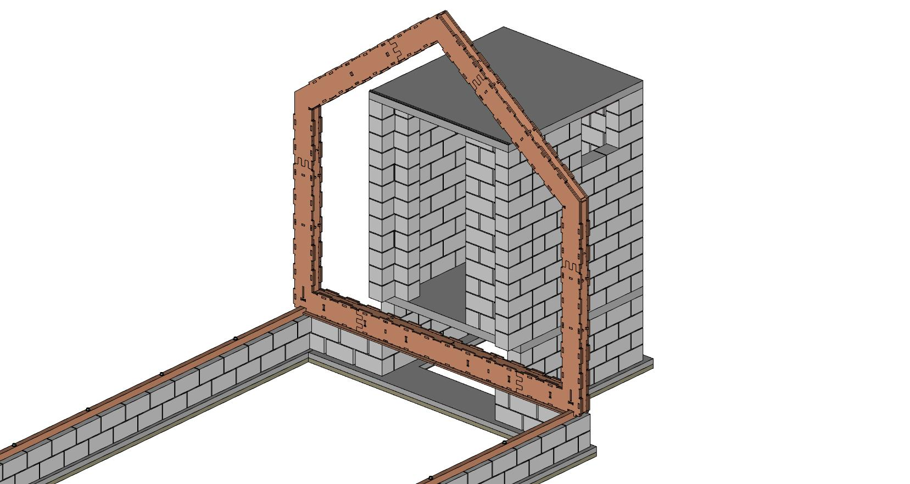

Cada elemento estrutural deve ser fixado às vigas-guia por cantoneiras metálicas parafusadas, usando duas cantoneiras de cada lado (4 por elemento):

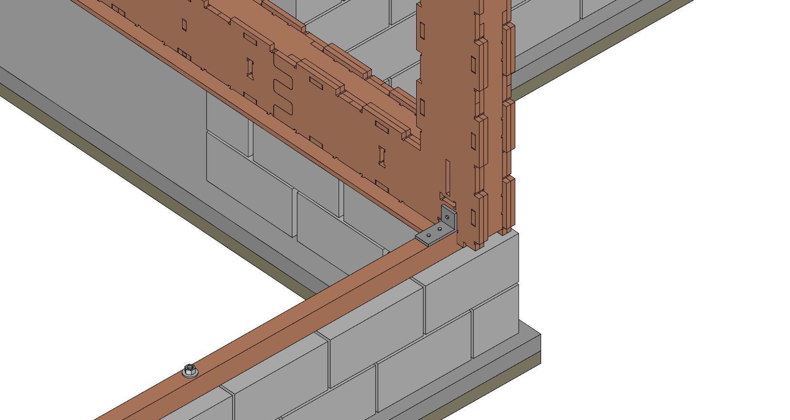

Em seguida são colocados 3 espaçadores superiores e 8 espaçadores inferiores:

E uma novo elemento estrutural, na distância marcada pelos espaçadores:

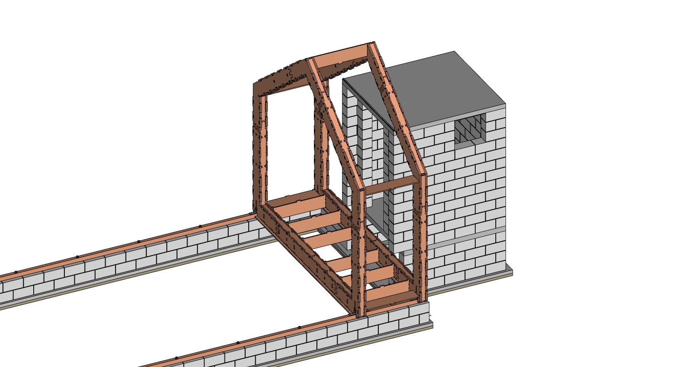

Este novo elemento também é fixado às vigas-guia por cantoneiras metálicas:

O mesmo procedimento de repete até instalar os 8 elementos:

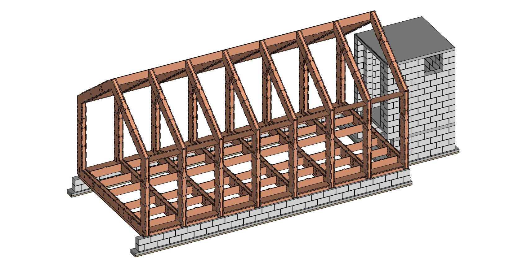

O último elemento coincide exatamente com o fim da viga-guia:

Esse elemento é afixado com um ferro chato em vez de cantoneira:

Novamente, se a próxima etapa não for feita imediatamente, é importante cobrir e proteger esta estrutura da chuva, por exemplo com lona plástica.

**Falta**: Imagem geral

### 2.3. Painéis de fechamento

Uma vez a estrutura erguida, os painéis de fechamento interiores e exteriores são colocados em cada módulo. São 3 módulos inteiramente fechados, e 4 módulos com janela. A disposição desses módulos pode ser mudada na hora de montar, no projeto original, a sequência é:

* 1 módulo fechado (laranja)
* 2 módulos com janela do lado esquerdo
* 1 módulo fechado (laranja)
* 2 módulos com janela do lado direito
* 1 módulo fechado (laranja)

Todos os módulos são simétricos, o lado pode ser invertido na obra se desejar.

Os painéis exteriores são colocados primeiros:

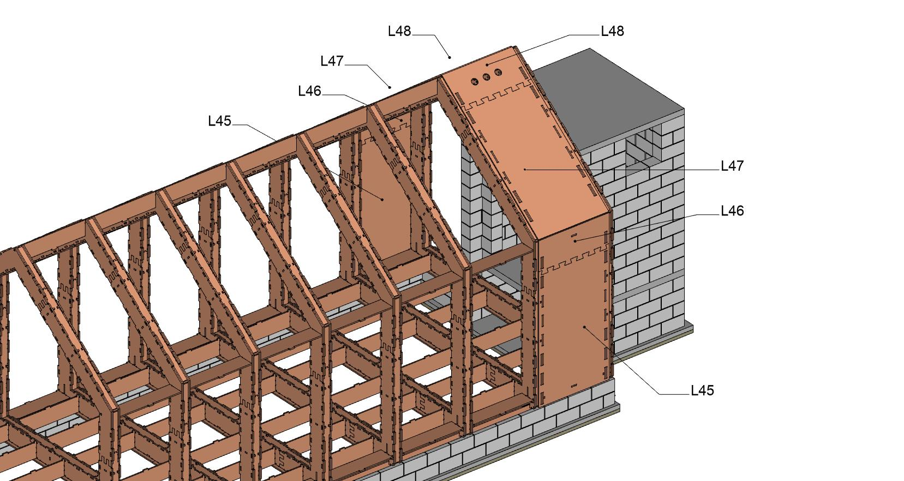

Em seguida, os painéis do fundo do piso. Esses painéis devem idealmente ser envernizados ou pintados, ou ser feitos com compensado resistente a umidade, antes da montagem. Esses painéis são colocados por dentro, simplesmente apoiados em cima dos "skis":

Finalmente os painéis interiores são colocados:

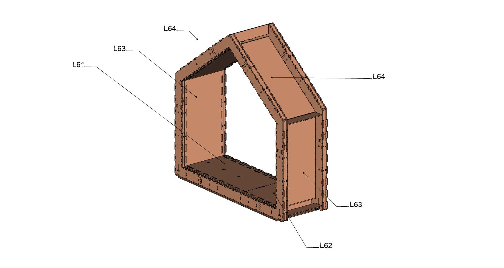

A mesma operação é repetida para os 2 outros módulos fechados. Para os 4 módulos com janela, a sequência de montagem é a mesma, mas o número das peças é diferente. As peças exteriores:

e interiores:

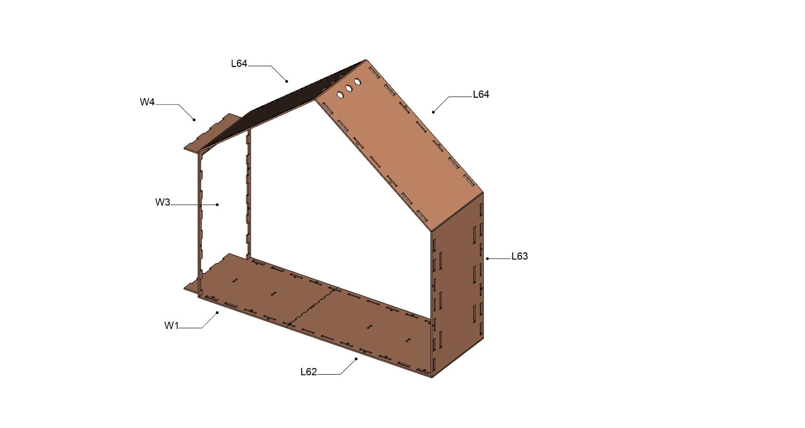

Para aumentar a resistência do conjunto, todas as peças interiores e exteriores devem ser parafusadas aos elements estruturais, usando parafusos de 35mm.

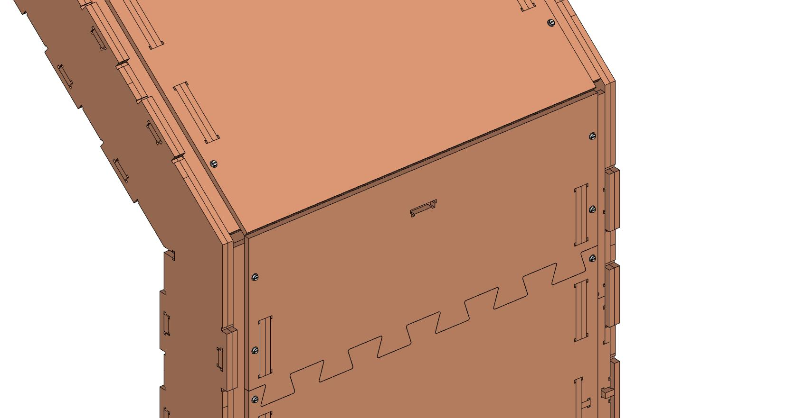

Devem ser usados mínimo 4 parafusos para as peças pequenas (L46, L48, L61), e 8 parafusos para as peças grandes (L45, L47, L62, L63, L64, W1, W3). São um pouco menos de 100 parafusos por módulos.

Novamente, se a operação posterior não vai ser feita imediatamente, é indispensável proteger esta estrutura da chuva, por exemplo com lona plástica.

**Falta**: Imagem lona

**Falta**: Imagem geral

## 3. Cobertura

A cobertura funciona como um guarda-chuva, e protege a estrutura de madeira da chuva, sem encostar nela, para permitir que o ar passe em volta da madeira. Esse ponto é muito importante para garantir que a madeira sempre possa secar sem que se forme condensação. 

**Falta**: Imagem geral

Para que o ar circule entre a madeira e a cobertura, aberturas são deixadas, para que o ar mais frio (mais pesado) entre por baixo, seja esquentadopelo sol batendo na cobertura, suba (o ar quente, mais leve, sobe) e possa escapar por aberturas superiores.

Desse modo, não somente impedimos a água de atingir a madeira, mas também permitimos uma ótima secagem caso alguma umidade consiga chegar de algum modo até a madeira.

### 3.1. Montagem da estrutura da cobertura

Uma primeira camada de ripas de 3cm x 3cm é parafusada na estrutura de madeira. São 60 ripas de 260cm, com 6 parafusos de 45mm por ripa (360 parafusos no total)

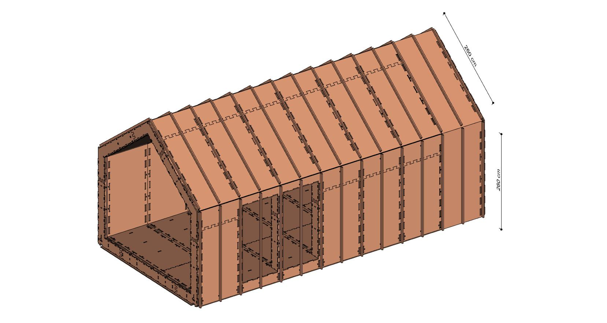

A seguir, são colocadas ripas transversais, também de 3cm x 3cm. São 24 linhas de 905cm. Usando ripas de  3.5m, são 72 peças. Deve ser colocado um parafuso de 55mm a cada cruzamento com ripas verticais. No total, são 360 parafusos.

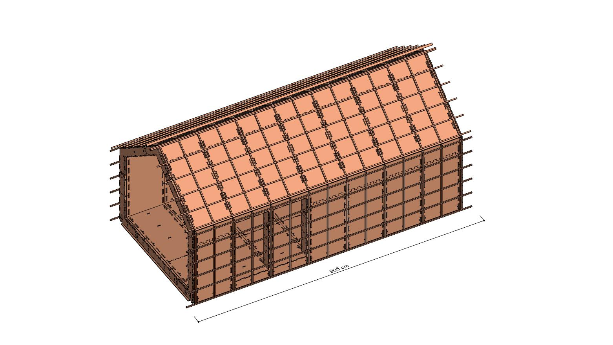

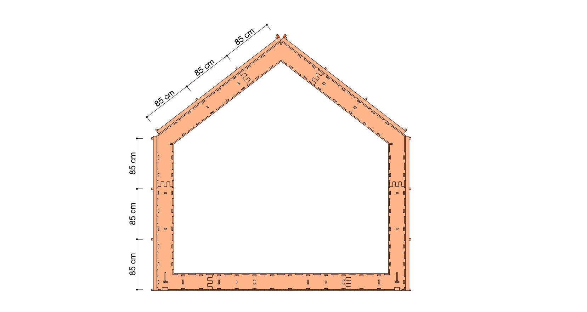

As emendas entre as diferentes ripas devem ser feitas quando cruzam as ripas verticais:

No topo, duas ripas de 3x6cm são parafusadas a última fileira de ripas horizontais. Essas duas ripas maiores suportarão a cumeira.

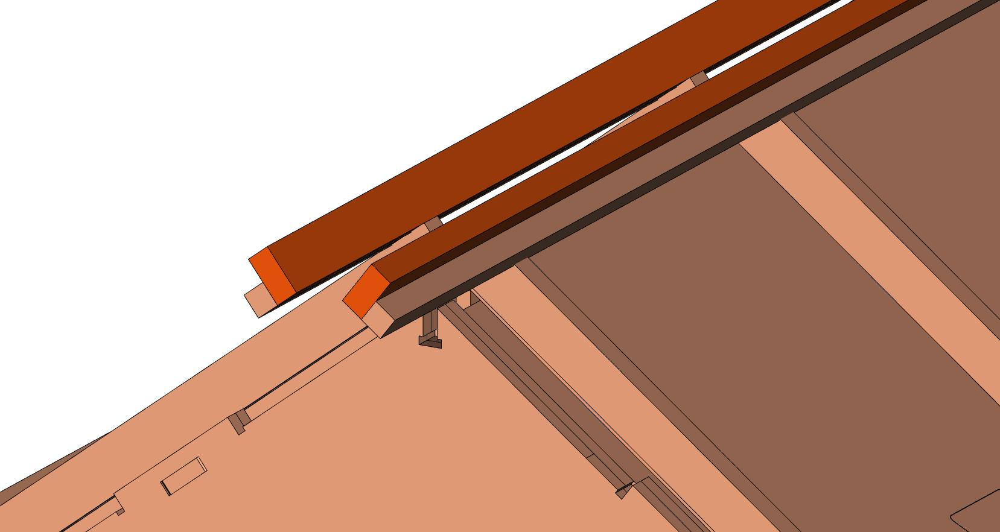

### 3.2. Colocaço das telhas

A cobertura é prevista para ser feita com telhas de polipropileno transparentes. Podem também ser usados painéis de policarbonato, ou fibro-cimento, nestes casos verificar as recomendações de montagem do fabricante, e adaptar os instruções abaixo se necessário.

As telhas de polipropileno são baratas, e como são tranparentes, deixam passar a luz. No entanto, deixam também passar muito sol. Pode ser necessário cobrir elas depois de prontas, totalmente ou parcialmente, por exemplo pintando com spray de tinta branca, ou deixando crescer vegetação rasteira, ou, idealmente, plantando árvores ao redor da construção, o que também vai protegê-la do vento.

No total são 2 painéis de 270cm x 905cm e dois painéis de 280cm x 905cm, e 905cm de cumeira:

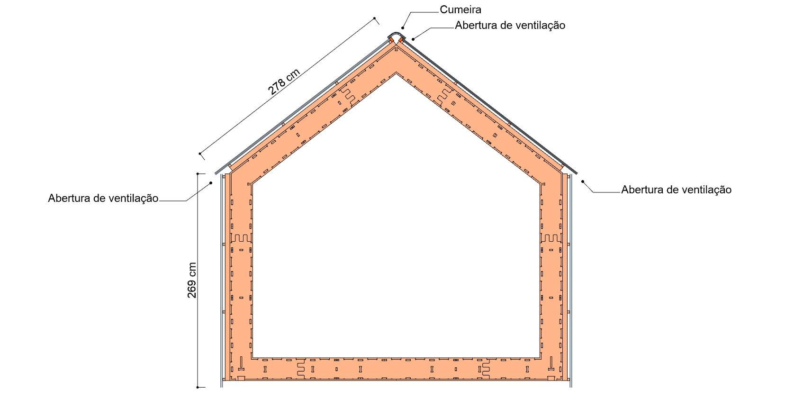

As telhas devem ser montadas com o lado liso virado para o exterior. Quando colcoadas uma ao lado da outra, devem cobrir duas ondulações da telha anterior:

É recomendado usar telhas de comprimento maior que 280cm, para que cada pano seja feito de uma telha só. Caso não for possível, o recobrimento mínimo entre uma telha e outra no sentido do comprimento é de 30cm:

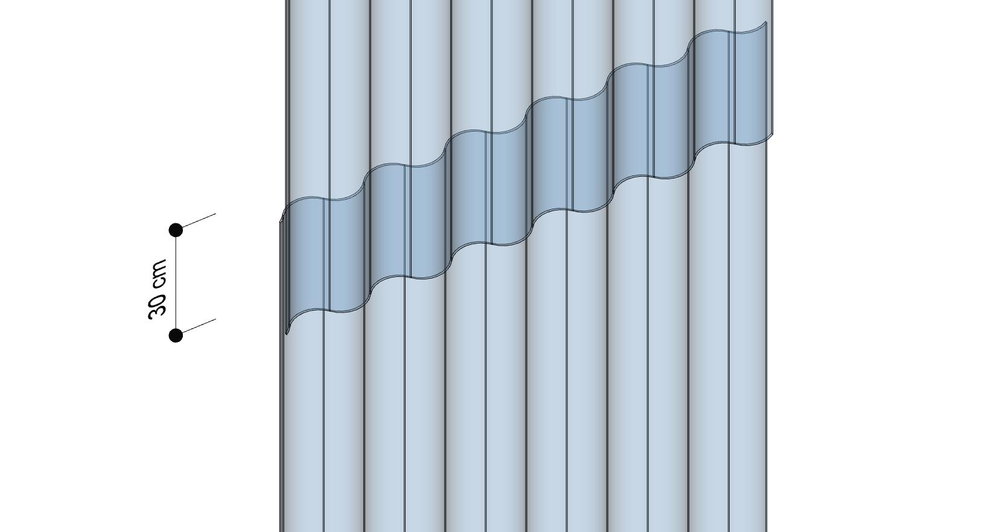

As telhas devem sempre ter um parafuso na primeira e última ondulação. A primeira onda deve passar da borda da madeira de 5cm, para protegê-la.

**Falta**: quantidade de telha de 305cm

A linha inferior da telha superior deve formar uma linha horizontal com a linha superior da telha inferior, para evitar que chuvas com muito vento consigam entrar:

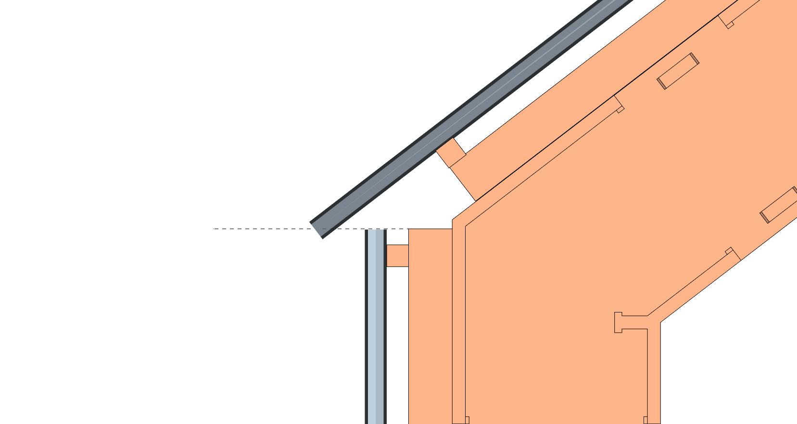

As telhas são afixadas com parafusos apropriados, com uma rodela de borracha de cada lado da telha, no máximo a cada 50cm (diminuir essa medida se necessário, para cair num número certo de ondulações). Veja mais recomendações para fixação das telhas, inclusive com recomendações de regulagem da prafusadeira [nesta página](http://www.hipertelhas.com.br/parafusos-de-fixacao-para-telhados.html) e [nesta outra página](https://www.pinezi.com/data/arquivos/downloads/Manual%20Telhas%20Translucidas%20ESAF.pdf):

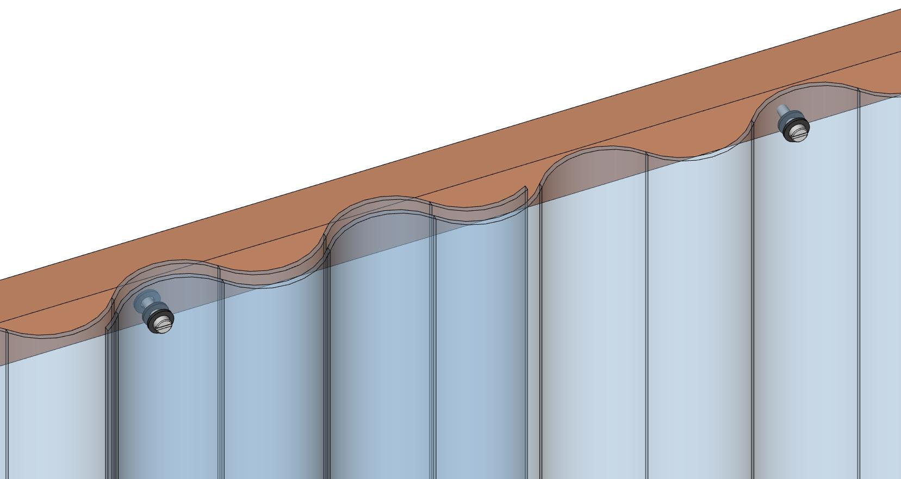

**Falta**: descrição e quantidade de parafusos

### 3.3 Cumeira

A cumeira pode ser de outro material caso não se encontre cumeira com o mesmo aspecto que as telhas. O tamanho da onda não precisa ser igual, já que a cumeira não vai encostar nas telhas.

A cumeira também deve respeitar as mesmas duas ondulações de sobreposição das demais telhas. É afixada sobre as duas ripas maiores colocadas anteriormente, de maneira a permitir a saida do ar entre a cumeira e as telhas:

É afixada com os mesmos parafusos e rodelas que as telhas:

**Falta**: Imagem geral

## 4. Marcenaria e caixilharia

**Falta**: Imagem geral

### 4.1. Janelas e portas na alvenaria

Existe uma porta de madeira e um caixilho metálico a serem colocados na parte de alvenaria. Ambos são de dimensões padrão e podem ser comprados diretamente no comércio.

A porta é de madeira é uma porta padrão de 80cm x 210cm (essa é a dimensão do vão de alvenaria, não da folha da parta, que mede 73cm de largura, deixando 7cm para os dois montantes, um de cada lado, de 3.5cm cada um). A porta simplesmente se parafusa na alvenaria, usando buchas.

Antes de instalar a porta, deve ser decidido o sentido de abertura. A porta tem 4 configurações possíveis, deve ser pensado onde vai ficar a folha da parta quando for aberta e se não bate em obstáculos ou móveis, ou dificulta o acesso.

Em cima da porta existe um espaço de 29 cm a ser fechado com dois painéis de madeira de 29 x 80cm, por exemplo sobras dos painéis de OSB, afixados em duas peças de madeira de 29cm parafusadas na parede:

O caixilho lateral é um caixilho de alumínio do tipo basculante, também chamado "Maxim-ar", de 60cm x 60cm. É muito comum e fácil de encontrar em lojas. É fixado diretamente na alvenaria, com parafusos e buchas.

A base de alvenaria em baixo do caixilho deve ser protegido da chuva. Os blocos de concreto precisam ser grauteados, e alguma forma de proteção posta em cima, por exemplo usando uma folha de aço galvanizado presa entre o caixilho e a alvenaria:

### 4.2. Estruturas frontal e traseira

Nas partes frontais e traseira da construção de madeira, são colocados conjuntos feitos com caibros de madeira parafusados na estrutura de OSB. Nesses caibros são colocados caixilhos de alumínio de tamanho padrão, comprados em lojas, fechamentos de vidro, e fechamentos de painéis de madeira envernizados.

O suporte é feito com caibros de 6x6cm afixados diretamente na construção de OSB com cantoneiras metálicas parafusadas. A parte frontal permite a inclusão de uma porta de alumínio de 90cm x 210cm, e duas janelas de 120cm x 100cm. A parte traseira inclui duas janelas de 80cm x 80cm. As partes restantes são fechadas com vidro fixo afixado em réguas de madeira, e placas cimentícias do lado exterior, e painéis de OSB do lado interior.

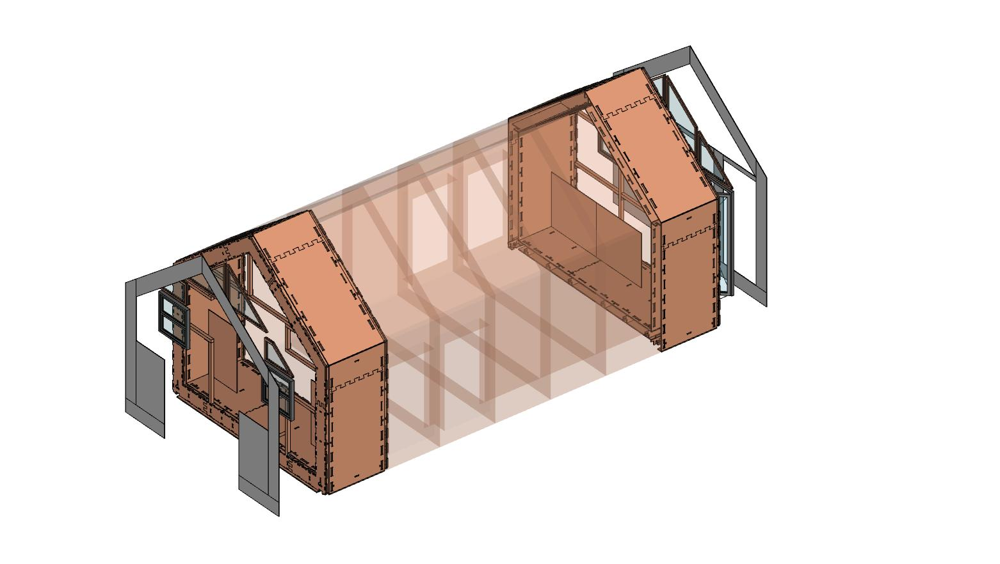

#### 4.2.1 Fachada frontal

A fachada é composta de 3 camadas: 1) uma estrutura de caibros de 6x6cm, 2) um revistimento exterior de placas cimentícias, e 3) um revestimento interior de OSB. Na estrutura de caibros também são afixados os caixilhos e vidros fixos.

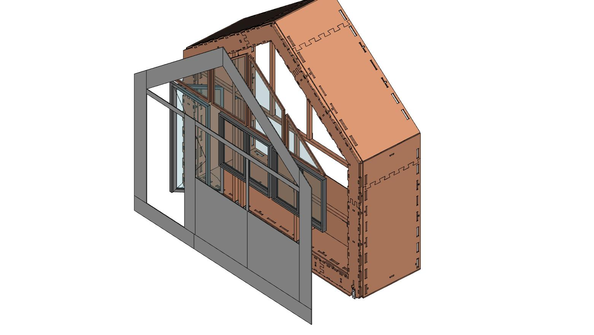

A estrutura de caibros é fixada diretamente no módulo WikiHouse com cantoneiras metálicas parafusados, ou pregos onde possível. Os caibros devem ser envernizados, ou deve ser usado madeira tratada para uso no exterior.

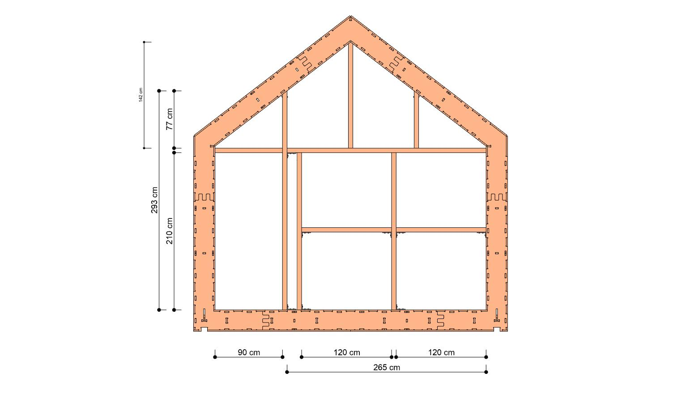

Os caixilhos de alumínio são parafusados dirtamente nos caibros, usando as instruções do fornecedor dos caixilhos:

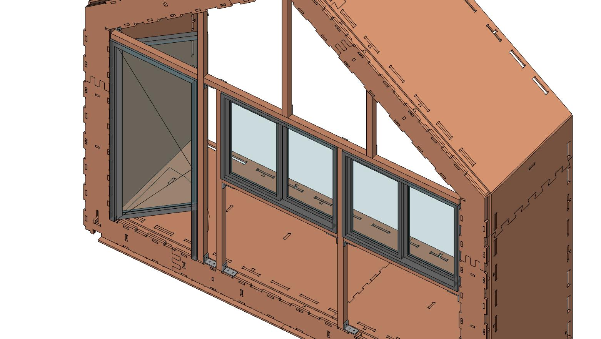

Na parte superior, 4 quadros feitos com régua de madeira de 1.5cm x 1.5cm são pregados aos caibros, e 4 folhas de vidro são afixadas nestas réguas com massa de vidraçeiro. A régua fica do lado interior, e a massa de vidraçeiro do lado exterior:

O lado exterior é coberto com placas cimentícias parafusadas nos caibros:

A junção entre as placas cimentícias, e entre as placas cimentícias e as partes aparentes dos caibros e caixilhos, deve ser vedada com silicone, de maneira a formar uma fachada inteiramente impermeável.

As bordas dessa fachada, entre as placas cimentícias e a telha de polipropileno, fica aberta para permitir a passagem do ar:

**Falta**: painéis interiores

#### 4.2.2 Fachada traseira

O procedimento é idêntico na fachada traseira, com medidas diferentes. Abriga dois caixilhos de alumínio basculantes de 80cm x 80cm.

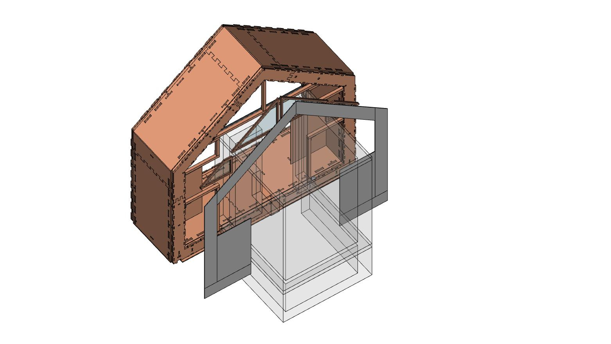

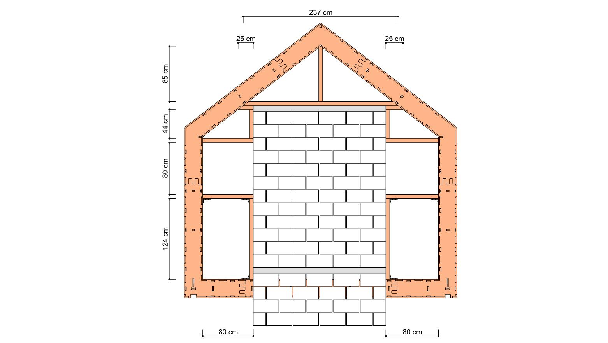

Os caibros que ficam rentos à alvenaria não devem ser parafusados à alvenaria, para que possa ocorrer um movimento vertical entre a parte de alvenaria e a parte de madeira. A junta entre a madeira e a alvenaria deve ser selada com silicone (indicado em vermelho na imagem abaixo):

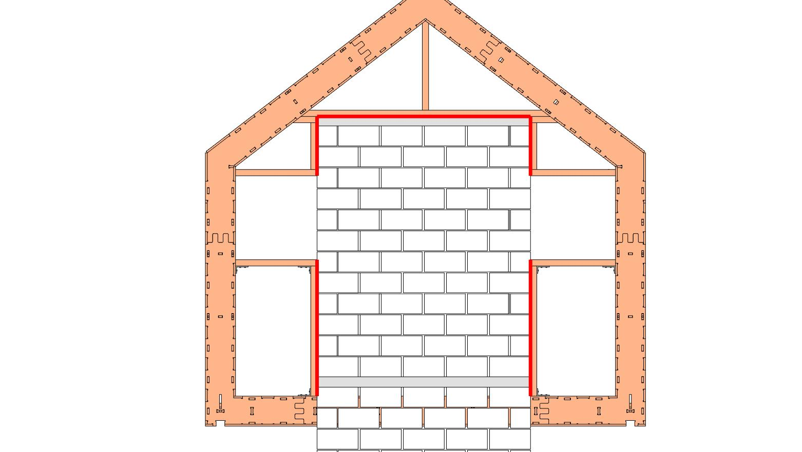

Dois caixilhos de 80cm x 80cm são colocados, e axixados apenas na madeira. A borda que fica rente a alvenaria é vedada com silicone.

4 folhas de vidro fixas são instalada da mesma maneira que a fachada da frente:

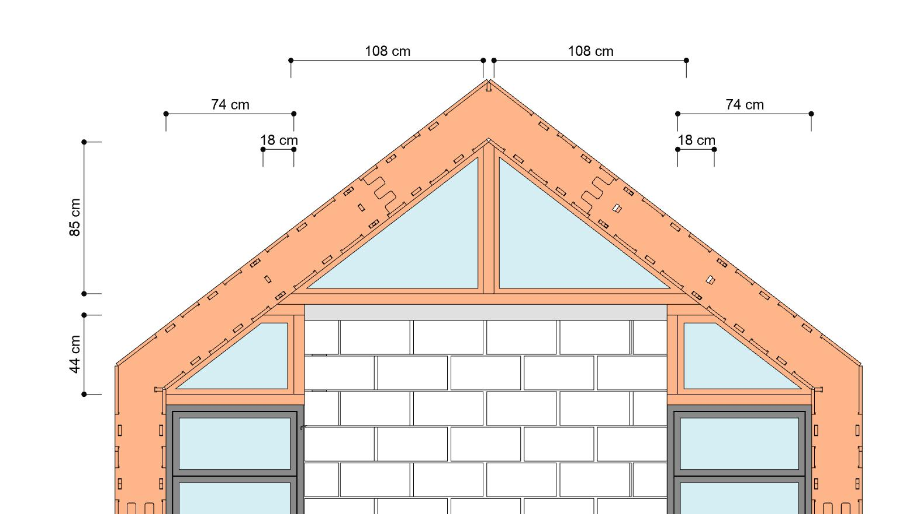

E o todo coberto com placas cimentícias da mesma maneira que a outra fachada:

3 painéis de OSB de 1cm são parafuusados aos caibros, do lado interior:

A fachada acabada:

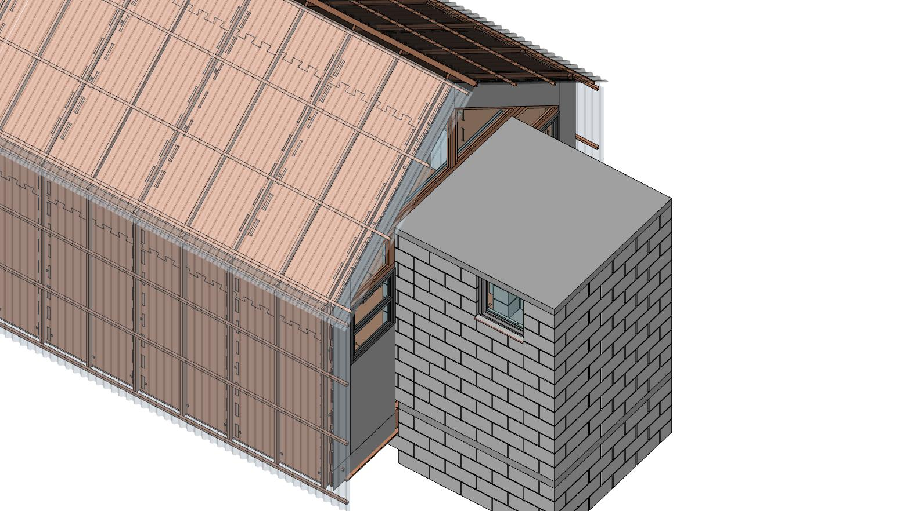

**Falta**: Imagem geral

## 5. Acabamentos

Item cancelado

### 5.1. Rampa

**Falta**

## 6. Eletricidade

**Falta**

