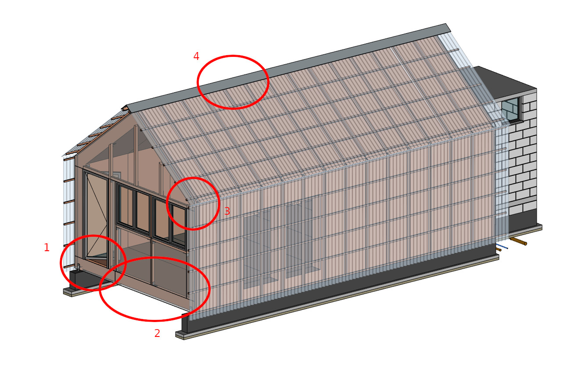
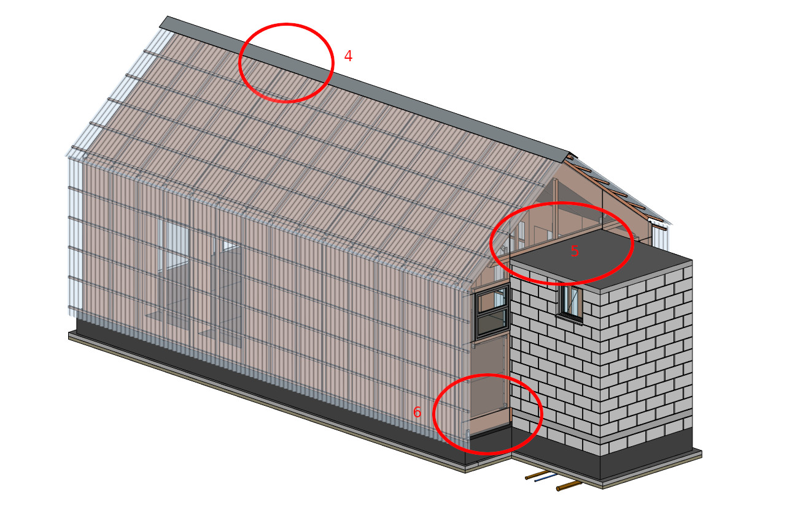
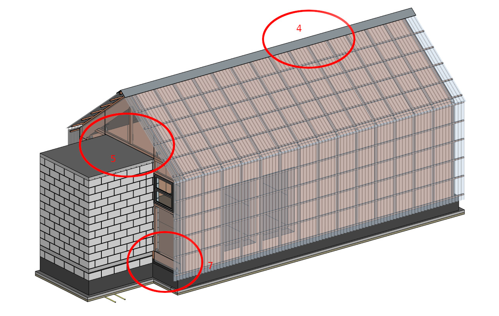
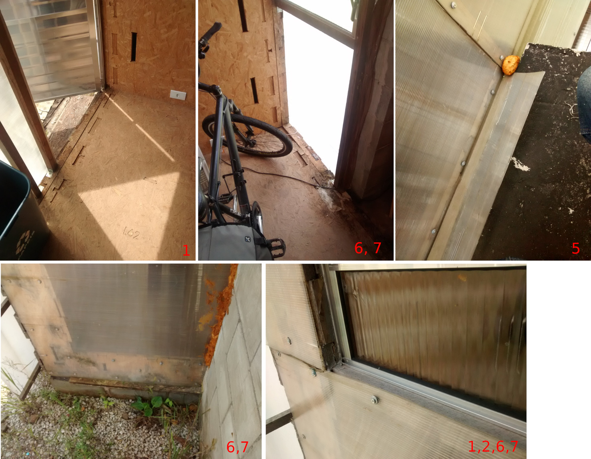
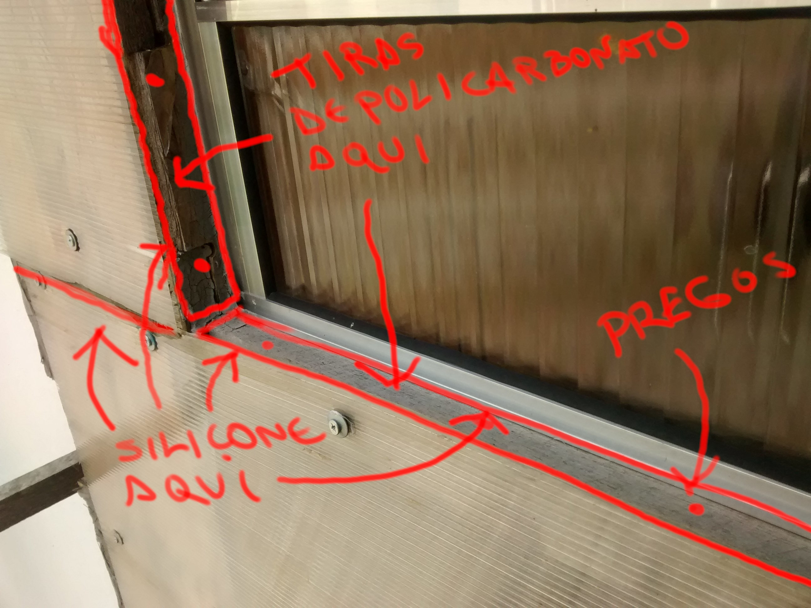
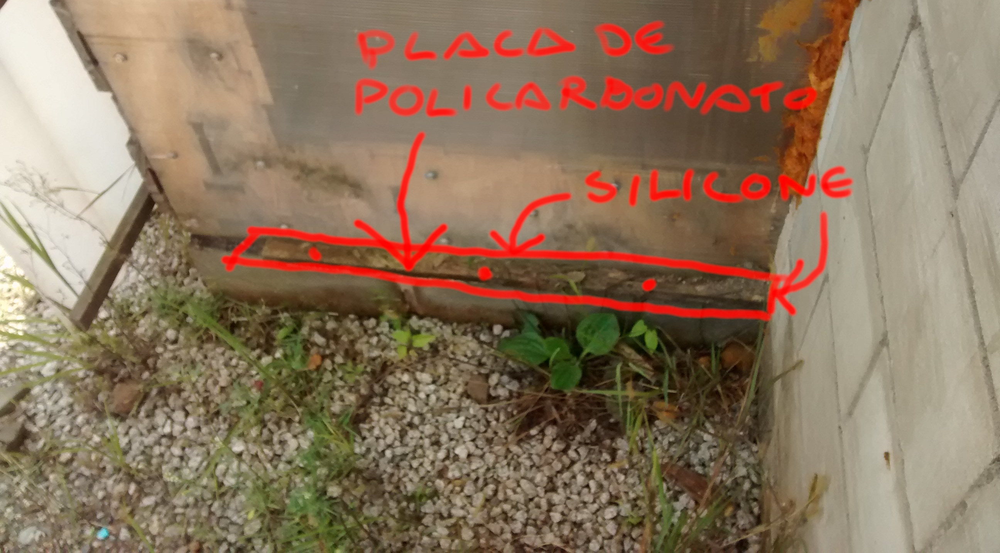
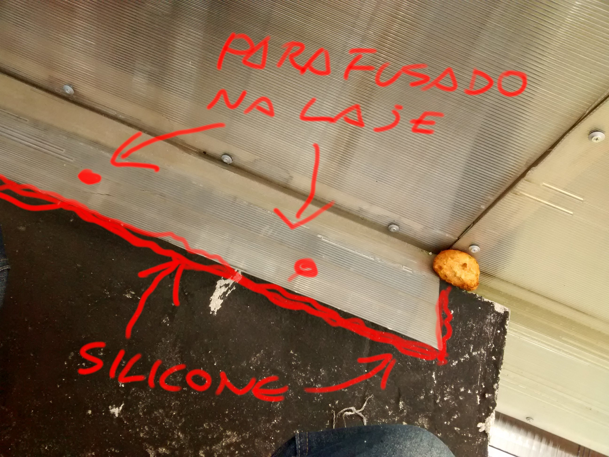
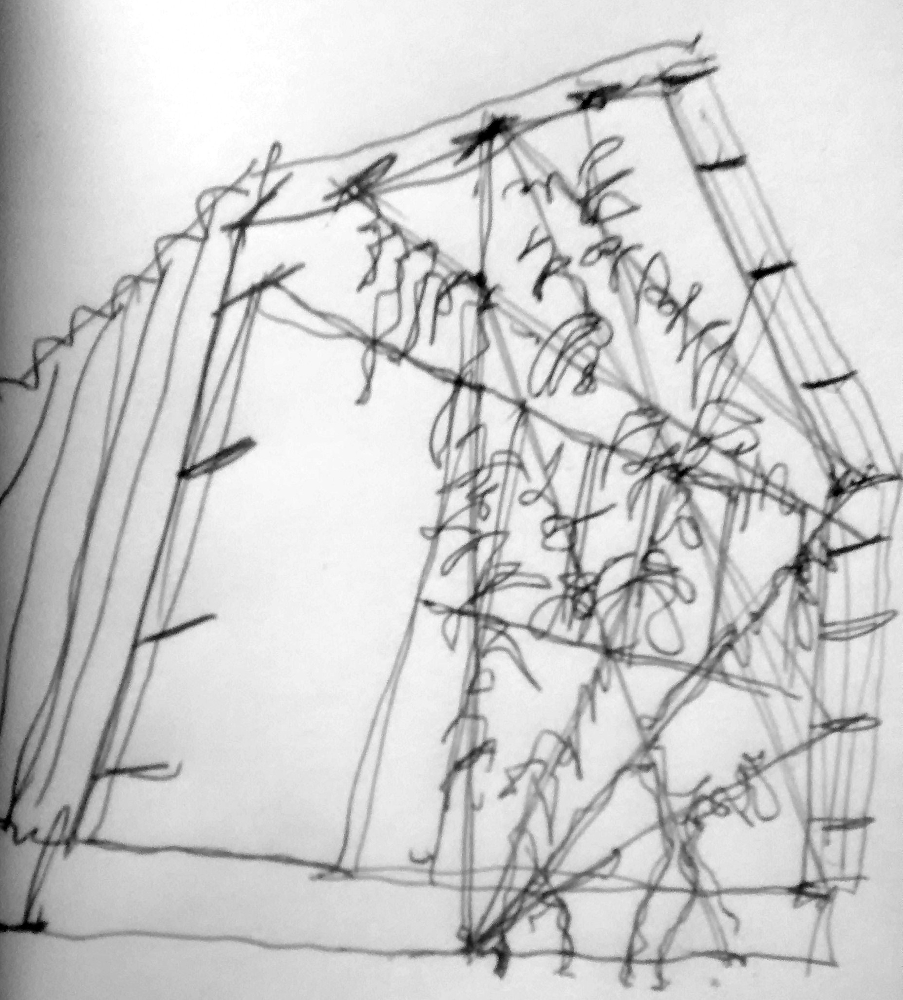

## Relatório de danos e reparos a efeituar no WikiLab

Elaborado por Yorik van Havre, [uncreated.net](http://www.uncreated.net) 15 de Março de 2019

### Danos constatados no WikiLab

Em geral, o WikiLab resistiu bastante bem desde a sua construção até agora. Não foram constatados nenhum dano grave, a quase totalidade são problemas de infiltração de água devida a vedação insuficiente entre os paineis de policarbonato alveolar das duas fachadas verticais Norte e Sul. Foram identificados os seguintes problemas:

* A água de chuva consegue entrar por dentro pelas frestas deixadas entre as placas de policarbonato, ou entre as placas de policarbonato e os caixilhos de portas e janelas. Estava prevista uma vedação melhor ali, que nunca foi feita. A água que se infiltrou danificou partes da madeia, geralmente no piso, que é onde a água acaba acumulando. Indicado nas imagens abaixo nos pontos **1,2 3,6,7**.
* A água consegue também, por vento forte, atingir as faces laterais, normalmente protegidas pelas telhas de polipropileno onduladas. Porém, ali é um dano muito superficial, que só alcance alguns centímetros, e não são motivos para preocupação, já que a madeira consegue secar com facilidade. Não está indicado nas imagens abaixo.
* Alguns dos elements de cumeira metálicos foram também mal instalados, e se deslocaram com o tempo e a força do vento nas telhas. Em um lugar, a telha de polipropileno conseguiu se soltar da cumeira, e não está mais presa em baixo. Por vento muito forte e indo na direção errada, a água consegue entrar entre a cumeira e as telhas Indicado nas imagens abaixo no ponto **4**.
* A placa de policarbonato em cima da laje de concreto está insuficientemente vedada, e a água consegue entrar para baixo dela. Indicado nas imagens abaixo no ponto **5**.
* Partes da madeira não está cobertos com placas de policarbonato e estão totalmente expostas à chuva. Indicado nas imagens abaixo nos pontos **6 e 7**.

Fotos dos problemas acima e dos danos provocados:

Mais fotos das partes danificadas estão [disponíveis aqui](../foros/relatorio-2019.03.15).

### Reparos propostos

Todos os problemas acima podem ser facilmente resolvidos melhorando a vedação **exterior** do WikiLab. O elemento responsável pela impermeabilização é a "pele" exterior do WikiLab (telhas de polipropileno onduladas e placas alveolares de policarbonato). É importante ressaltar que todos os reparos devem ser feitos no exterior, porque se a pele é comprometida, e a água consegue entrar, vedar pelo interior não adianta, e pode até piorar as coisas provocando retenção de água.

As partes de madeira já danificadas não podem ser restauradas, e vão continuar com o visual danificado. No entanto, se cortamos a fonte de humidade, elas vão secar, e os problemas vão parar ali.

Propomos os reparos seguintes. Os pontos 1,2 e 3 são os mais urgentes:

#### 1. Vedar as juntas entre as placas de policarbonato, e entre as placas e os caixilhos metálicos, com silicone

Todas as bordas das janelas (exceto as bordas superiores, onde a água não consegue entrar), devem ser cobertas e vedadas com silicone, de maneira a formar uma superfície completamente impermeável entre os caixilhos metálicos e o policarbonato. Onde existe um espaço muito grande para ser coberto, pode ser pregado uma tira de policarbonato, para diminuir a quantidade de silicone a ser usado.

Exemplo:

**Material necessário estimado:**

* 4 ou 5 bisnagas de silicone, preferencialmente transparente, e uma "pistola" para as bisnagas (contando para todos os reparos deste relatório)
* Algumas tiras de policarbonato cortados a partir das sobras existentes (medir no local, onde precisar)
* Trena de medir, Estilete para cortar o policarbonato, régua para guiar o corte
* Pregos +/- 4cm e martel

#### 2. Cobrir as partes de madeira expostas no pé da fachada traseira

Mesma técnica que o ponto acima, vedar todo com silicone depois. Do lado direito, essa placa fica em contato com o solo, o que deve ser evitado também. Sugerimos cavar alguns centímetros para baixar o nível do terreno ao redor desse pedaço de madeira

#### 3. Vedação acima da laje

Deve ser afixado o pedaço de policarbonato "solto" na laje, usando parafusos com buchas, e vedado com silicone depois:

**Material necessário estimado:**

* 5 ou 6 parafusos de +/- 4cm de comprimento (não passar de 6cm), com buchas apropriadas
* Furadeira com broca apropriada às buchas escolhidas
* Extensão elétrica

#### 4. Troca de um elemento de cumeira

Deve ser comprado um elemento adicional de cumeira em chapa de aço galvanizado (a espessura não tem muita importância), fabricado especialmente por uma funilaria com as dimensões abaixo. Se trata de um elemento simples e relativemente barato:

Este elemento deve ser furado na hora de instalar (min. 4 furos), e parafusado no lugar do elemento antigo, que deve ser removido (e guardado para reuso futuro). Os parafusos existentes podem ser reaproveitados aqui.

**Material necessário estimado:**

* Broca grande para furar o metal (verificar tamanho dos parafusos existentes)

#### 5. Troca da soleira da porta de entrada

A soleira da entrada está danificando rapidamente. Pode ser trocada por uma peça de madeira boa (cumaru, cedor, mogno) que não vai danificar muito rapidamente e resistir por vários anos. Tamanho estimado (medir no local antes de encomendar/comprar): 85cm x 6cm x 3cm

Pode ser necessário a retirada da porta para retirar a peça existente e por a soleira nova

### Considerações adicionais

* A fechadura da porta está danificada. Deveria ser trocada em algum momento
* O calor forte dentro do WikiLab tem duas causas principais: 1) A ventilação insuficiente (foram instaladas janelas menores do que as previstas inicialmente), e 2) A exposição muito grande da fachada da frente aos raiso do sol. O ponto 1) não pode ser melhorado muito facilmente, a não ser estudando uma maneira de fazer aberturas temporárias nas placas de policarbonato), mas o ponto 2) poderia ser resolvido de uma maneira bastante fácil e agradável instalando cabos metálicos e deixando plantas trepadeiras subir neles. Isso, obviamente, ia requerer uma manutenção cuidadosa para evitar que as plantas penetrem dentro do WikiLab:

